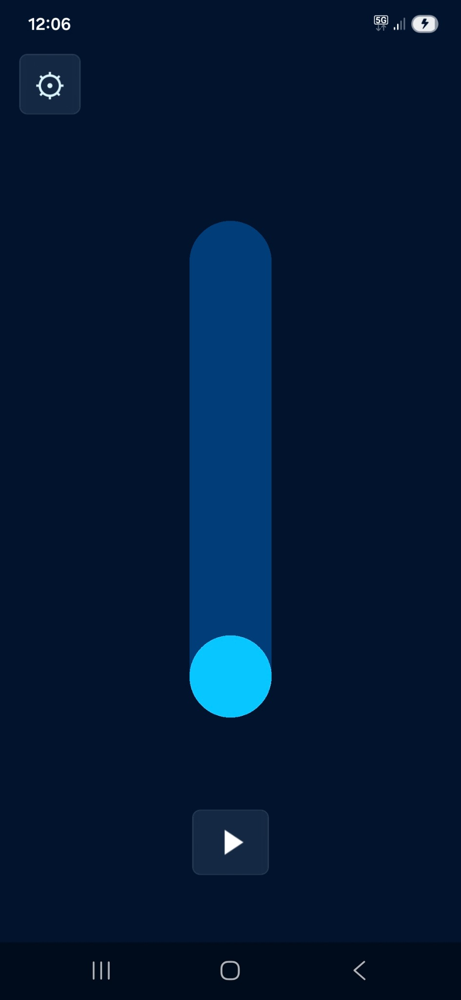
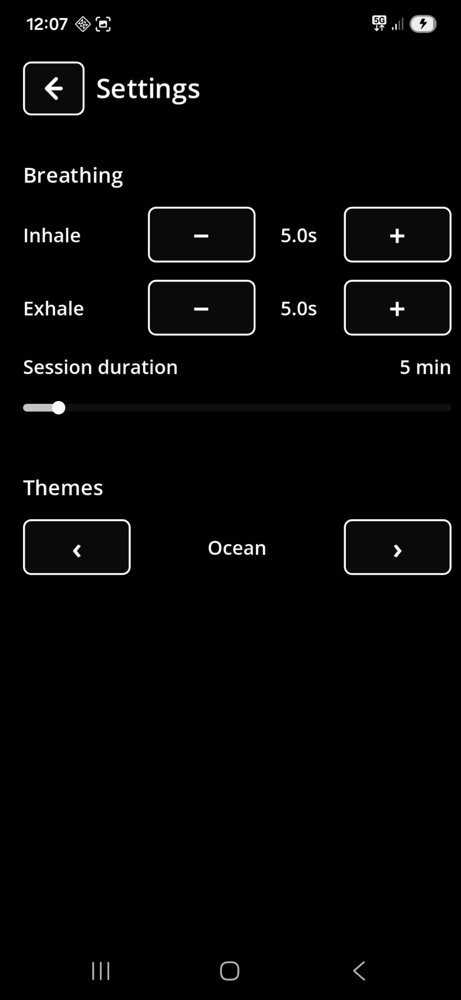

# Essential Breathing

A calm, minimal breathing app for the web.

Essential Breathing helps you follow a simple breathing rhythm with a clear visual guide: a ball moves up as you inhale and down as you exhale. The app is intentionally quiet and uncluttered, so you can focus on the breath rather than on menus, badges, streaks, or distractions.

## Try it online

The app is available here:

https://egofree71.github.io/EssentialBreathingWeb/

It can be used directly in a browser, without creating an account or installing anything.

  
   &nbsp;&nbsp;&nbsp;
  

## Features

- Simple visual breathing guide
- Smooth ball movement inside a vertical gauge
- Adjustable inhale duration
- Adjustable exhale duration
- Adjustable session duration
- Start, pause, resume, and stop controls
- Several visual themes
- Clean mobile-friendly layout
- Available in English, French, and Spanish
- No account required
- Works directly from the browser
- Can be installed as a PWA on compatible browsers

## Why this app?

Many breathing apps try to do everything: lessons, subscriptions, statistics, gamification, social features, and a small festival of notifications.

Essential Breathing does the opposite. It keeps the experience simple: choose a rhythm, press play, and breathe.

## Mobile use

Essential Breathing can be used directly in a mobile browser.

On compatible browsers, it can also be added to the home screen as a Progressive Web App. This gives a more app-like experience and allows the app to keep working offline after it has been loaded once.

On Android, Chrome is recommended for installing the PWA. Some browsers may show additional warnings when installing web apps.

## Status

Essential Breathing is a small personal project. The web version is available online through GitHub Pages and can be used on desktop or mobile browsers.

## Technical notes

This README is meant to present the app in a simple, user-facing way.

More technical notes are available in:

- [`_devdocs/ARCHITECTURE.md`](_devdocs/ARCHITECTURE.md)

## License

This project is released under the MIT License.
